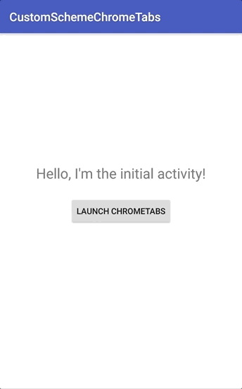

# CustomURLScheme-CustomChromeTabs

## What's this?
A minimal Android application that receives callback using Custom Chrome Tabs.

It might be useful if you want to create an application that works an authorization protocol like [`OAuth`](https://auth0.com/docs/quickstart/native/android).

## Demo

